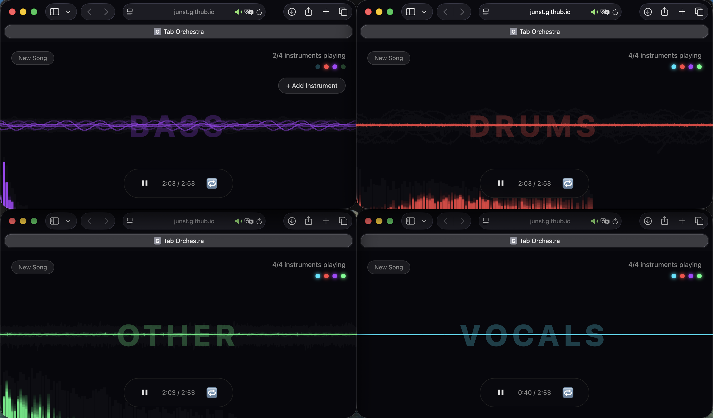

# Tab Orchestra — Multi-Tab Music Decomposition Art

Each browser tab plays one instrument stem. Open 4 tabs to hear the full song.



## How It Works

1. **Upload** a song or click **Use Demo**
2. The audio is separated into 4 stems (Vocals, Drums, Bass, Other) via [Demucs](https://github.com/facebookresearch/demucs)
3. **Tab 1** = Vocals (cyan), **Tab 2** = Drums (red), **Tab 3** = Bass (purple), **Tab 4** = Other (green)
4. Each tab shows a real-time waveform + particle visualizer for its stem
5. Close a tab → that instrument disappears. Reopen → it comes back

## Features

- **Multi-tab sync** — All tabs stay in sync via BroadcastChannel API
- **Per-tab mute** — Mute individual instruments without stopping others
- **3-band EQ** — Low / Mid / High equalizer per tab (±12 dB)
- **A-B Loop** — Set start/end markers to loop a specific section
- **Auto 4-split** — "Open All" button arranges 4 tabs into screen quadrants
- **Loop / Replay** — Toggle auto-replay when the song ends
- **Demo mode** — Pre-separated stems for instant testing
- **AI separation** — Upload any song → Demucs on HuggingFace Space separates it

## Architecture

```
User uploads song (or picks demo)
        ↓
HF Space (Demucs htdemucs) → 4 stems: Vocals, Drums, Bass, Other
        ↓
Browser stores stems in IndexedDB
        ↓
Tab 1 ←── BroadcastChannel ──→ Tab 2, 3, 4
Vocals      Drums    Bass    Other
(cyan)      (red)   (purple) (green)
```

## Tech Stack

- **Frontend**: Vanilla JS, Web Audio API, Canvas 2D, BroadcastChannel, IndexedDB
- **Backend**: HuggingFace Space with Gradio + Demucs (htdemucs model)
- **Deployment**: GitHub Pages (frontend) + HF Space (stem separation)
- Zero dependencies — no frameworks, no build step

## Project Structure

```
tab-orchestra/
├── index.html          # UI: upload, visualizer, controls
├── style.css           # Dark theme, stem colors, EQ panel
├── app.js              # Core logic (~950 lines)
│   ├── BroadcastChannel messaging
│   ├── IndexedDB stem storage
│   ├── Web Audio: source → EQ → gain → analyser → destination
│   ├── Canvas 2D: waveform bars + waveform line + particles
│   ├── Gradio 5.x SSE API client
│   └── Tab coordinator / role assignment
└── demo/
    ├── vocals.wav      # Pre-separated demo stems
    ├── drums.wav
    ├── bass.wav
    └── other.wav
```

## Live Demo

**[https://junst.github.io/tab-orchestra/](https://junst.github.io/tab-orchestra/)**

## Stem Separation Backend

HuggingFace Space: [solbon1212/tab-orchestra-demucs](https://huggingface.co/spaces/solbon1212/tab-orchestra-demucs)

- Demucs htdemucs model (CPU)
- Supports MP3, WAV, M4A, FLAC, OGG (auto-converts via ffmpeg)
- Max 5 minutes, 20 MB

## License

MIT
